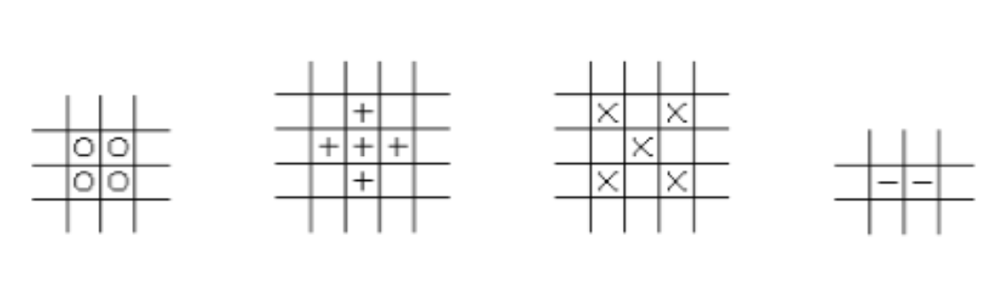

# Fig-UMa

### About the game

- The objective of this project is to develop a robot and the environment where it will act to play Fig-UMa. For this, a robot must be created and programmed, heuristics and strategies must be developed in order to allow them to be solved more effectively.

- There are four different pieces, each piece we associate a symbol (o, +, -, x) that allows us to refer to that piece. The board for this game is about 5x5. The objective is to arrange all the pieces of a random sequence of pieces on a board with the dimension n x n, in order to obtain as many points as possible and ensure that the final board has no pieces.

- In Fig-UMa, the pieces are initially placed in such a way that they can be read and known by the robot at the beginning of the game. The home board is empty. Points are obtained when complete figures are formed. The pieces that form these figures are removed from the board by the group members, not by the robot.

### Figures elimination and points getting

- Complete figures are formed from the shape of the corresponding pieces. Examples of complete figures are shown above:

- On the other hand, complete figures can have a greater number of pieces, as long as the proportions for each figure are maintained. Several variations of the previous figures are presented below.

