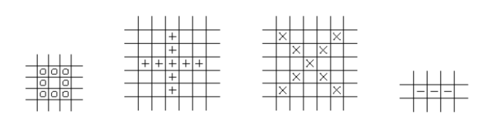

# Fig-UMa

### About the game

- The objective of this project is to develop a robot and the environment where it will act to play Fig-UMa. For this, a robot must be created and programmed, heuristics and strategies must be developed in order to allow them to be solved more effectively. The robot is to be developed using a Lego Mindstorms EV3 set, which includes a color sensor, distance sensor and motors.

- There are four different pieces, each piece we associate a symbol (o, +, -, x) that allows us to refer to that piece. The board for this game is a 5x5 board. The objective is to arrange all the pieces of a random sequence of pieces on a board with the dimension n x n, in order to obtain as many points as possible and ensure that the final board has no pieces.

- In Fig-UMa, the pieces are initially placed in such a way that they can be read and known by the robot at the beginning of the game. The home board is empty. Points are obtained when complete figures are formed. The pieces that form these figures are removed from the board by the group members, not by the robot.

### Figures elimination and points getting

- Complete figures are formed from the shape of the corresponding pieces. Examples of complete figures are shown above:

- On the other hand, complete figures can have a greater number of pieces, as long as the proportions for each figure are maintained. Several variations of the previous figures are presented below:

- Figures that are completely filled in are eliminated. For each figure eliminated, points are obtained, which are added up throughout the game. The game ends when all the pieces have been placed, or when the board is full of pieces. The robot wins the game if it manages to place all the pieces and the final board is empty.

- The final game score is obtained by adding the scores obtained during the game with the elimination of the pieces. For each complete figure with n pieces that is eliminated, 2n points are added to the score.

### Heuristics used in the game
#### Big_O:
This pattern is used when there are enough O pieces to make the largest figure, with the drawback that there cannot be + and - pieces simultaneously

#### Big_Plus_X:
This pattern is used when there are enough + and X pieces to make both larger versions of the figures, and there are few - and O pieces, since there is not enough room for fit these figures.

#### Big_X:
This patters is used when there are enough X pieces to make a large X figure, but not a large + figure, and there is a maximum of 9 O pieces, since there is not enough room to complete that figure.

#### Big_Plus:
This is used whnere there are enough+ pieces to make a large figure, but not an X figure. It has a particularity of possibly getting stuck, in a very specific niche case, which was considered unlikely enough to ignore. 
First, there is an attempt to fill the O figures on the left corne. However, if there is an X there, the O will be places on one of the other 7 available locations, which will never complete a figure. From there on, it will check if the next position for an O piece is available. The block happens is 4 X pieces are placed, and then 10 consecutive 10 O pieces, without completing the X figure. 

## Simple:
In this patters, the figures made are always the smallest ones, with the exception of the - figure. Since there is no overlap between pieces and figures. It gives much fewer points that the alternatives. Since it will only happen when there are not enough pieces to make a larger figure, for a given set of pieces, if this pattern is chosen, it will be the optimal pattern.
